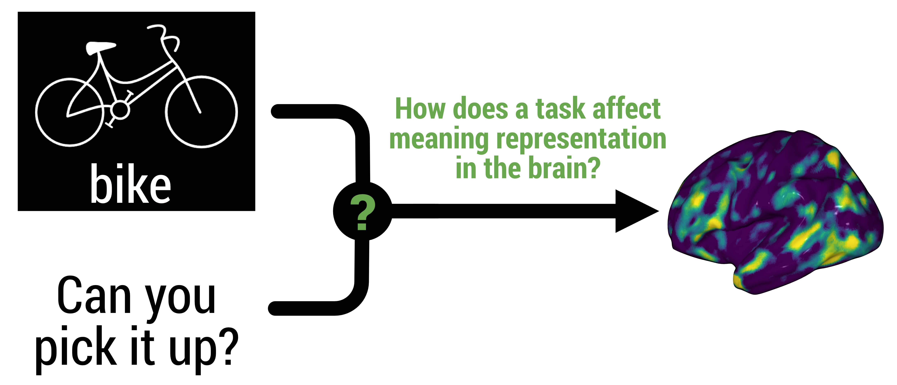

# Modeling Task Effects on Meaning Representation in the Brain via Zero-Shot MEG Prediction

This is the official code repository for
```
Modeling Task Effects on Meaning Representation in the Brain via Zero-Shot MEG Prediction.
Mariya Toneva*, Otilia Stretcu*, Barnabás Póczos, Leila Wehbe, and Tom Mitchell.
In Proceedings of the Thirty-fourth Conference on Neural Information Processing Systems 2020.
```

In this work, we study the effect of a task on the representation of meaning in the brain.



We include the implementation of the 4 hypotheses discussed in our
paper on how the task and stimulus may combine together to give rise to the 
recorded neural activity.


For more information about the methods in this repository, please check out our:
- [NeurIPS 2020 paper](https://arxiv.org/abs/2009.08424)
- [slides](https://drive.google.com/file/d/1-q7R3a0jxH_zE6of7aD4at6NgviyCZW8/view?usp=sharing)
- [3 min video](https://www.youtube.com/watch?v=-SXlEhSTSi8&feature=youtu.be&ab_channel=OtiliaStretcu)
- [13 min video](https://youtu.be/M1TpiYsRvt0?t=5552)


If using this code, please cite:
```
@inproceedings{taskeffects2020,
  title={Modeling Task Effects on Meaning Representation in the Brain via Zero-Shot MEG Prediction},
  author={Toneva*, Mariya and Stretcu*, Otilia and Póczos, Barnabás and Wehbe, Leila and Mitchell, Tom M.},
  booktitle={Proceedings of the Thirty-fourth Conference on Neural Information Processing Systems},
  year={2020}
}
```

##  Code structure

The code is organized into the following folders:

- **data:** contains classes and methods for loading and
  preprocessing data.
- **experiments:** contains the running script for running experiments for the
    20-Questions dataset discussed in our paper.
- **methods:** contains implementation of various models, and code for training them.
- **utils:** other utility functions, not specific to this project.


## Requirements

Our code was implemented in Python 3.7 with Tensorflow 1.15 using 
[eager execution](https://www.tensorflow.org/guide/eager).
It also requires the following Python packages:

- csv
- json
- keras==2.3.1
- matplotlib
- numpy
- pandas
- scipy
- seaborn
- sklearn
- tabulate
- tqdm
- urllib
- yaml

## Data

We thank Gustavo Sudre for collecting and sharing the MEG dataset, and 
Dean Pomerleau for the human-judgment Mechanical Turk dataset!
With their permission we provide the Mechanical Turk data. Additionally,
we provide the BERT and word2vec representations for the stimuli and questions
used in our experiments. Further details below.


### Mechanical Turk responses and semantic features
The Mechanical Turk responses for all combinations of 1000 words and 
229 questions can be found at `data/MTurk_semantic_features.npz`. We provide
further information on the structure of this file and how to load it at 
`data/README.md`.


### BERT semantic features
We provide the BERT representations used in our experiments presented in 
Appendix D. 
We provide further information on the structure of these files and how to load 
them at `data/README.md`.

### Word2vec semantic features
We provide the word2vec vector representations for the stimuli used in our
experiment. These can be found at `data/word2vec_dict.npz`. 
We provide further information on the structure of this file and how to load it at 
`data/README.md`.

### MEG data
Due to the IRB when the data was first collected, the brain data is 
unfortunately not available to share beyond the Mitchell laboratory. However, 
the existing code framework can be extended to other datasets by implementing 
necessary data loading pipelines. 
 
## How to run
The entry point of our experiments is at 
`src/experiments/run.py`.

To specify the intended hypothesis to test or other data preprocessing
or training configurations, make the desired choices in the experiment
configuration file at `src/experiments/config.py`.


To execute the code, from the main folder, run:
```
python3.7 -m src.experiments.run
```

When running the `RidgeWithLearnedAttention` model corresponding to hypothesis 
4.2 in our paper, we recommend running using a GPU. With CUDA, this can be done
using the command:
```
CUDA_VISIBLE_DEVICES=your-gpu-number python3.7 -m src.experiments.run
```
